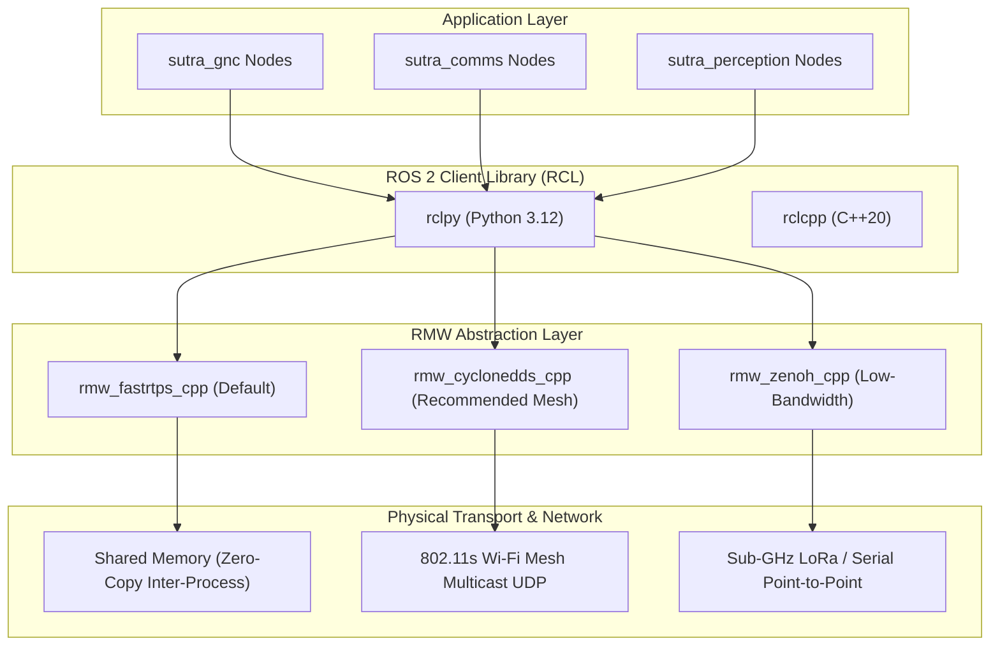

# 📖 Project SUTRA — Master Simulation Scenario Cookbook & ROS Middleware Guide

> [!important] Operational Purpose
> This cookbook provides copy-pasteable execution recipes for launching, monitoring, and stress-testing all **7 disaster simulation scenarios** in Project SUTRA. It details the underlying **ROS 2 Middlewares (RMW)**, DDS configuration XMLs, MicroXRCE-DDS Agent setups, and MAVLink telemetry routing.

---

## 📑 Table of Contents
1. [[#Section 1 Simulation Scenario Classification Matrix]]
2. [[#Section 2 ROS 2 Middleware RMW Infrastructure]]
3. [[#Section 3 Scenario 1 Coastal Flood Search & Rescue Kuttanad World]]
4. [[#Section 4 Scenario 2 Hilly Mountain Landslide & Canopied Recon]]
5. [[#Section 5 Scenario 3 5-UAV Ring Crossing & 3D Deconfliction Demo]]
6. [[#Section 6 Scenario 4 RF-Jammed Low-SNR Deep JSCC Transmission]]
7. [[#Section 7 Scenario 5 SwarmRAFT Distributed Consensus & Leader Kill Failover]]
8. [[#Section 8 Scenario 6 Distributed 2-Laptop Command Pipeline]]
9. [[#Section 9 Scenario 7 Motor Failure Spin Damping & Emergency Landing]]
10. [[#Section 10 Operational Troubleshooting & Clean Teardown Runbook]]

---

## Section 1: Simulation Scenario Classification Matrix

```
┌─────────┬──────────────────────────────────┬─────────────────────────────────┬──────────────────────────────────────┬───────────────────────┐
│ ID      │ Scenario Name                    │ Primary World / Launch Target   │ Invariants & Thresholds Tested       │ Subsystems Activated  │
├─────────┼──────────────────────────────────┼─────────────────────────────────┼──────────────────────────────────────┼───────────────────────┤
│ SCEN-01 │ Coastal Flood Search & Rescue    │ sutra_coastal_flood_world.sdf   │ VRAM < 1.4GB, Water z=1.65m, VIO lock│ Subsystem A, B, C, D  │
│ SCEN-02 │ Monsoon Landslide & Multipath    │ sutra_hyperreal_monsoon_world   │ Zero GPS lock, 45° slope, Thermal SAR│ Subsystem A, B, C     │
│ SCEN-03 │ 5-UAV Ring Crossing Demo         │ launch_ring_crossing_demo.sh    │ ORCA 3D clearance ≥ 2.80m @ 50Hz     │ Subsystem A, D        │
│ SCEN-04 │ RF-Jammed Deep JSCC Video Feed   │ run_deep_jscc_moat_demonstrator │ SNR down to -5dB, PSNR ≥ 38dB, 96.9% │ Subsystem B, C, D     │
│ SCEN-05 │ SwarmRAFT Consensus Failover     │ test_live_leader_switch.py      │ Leader failover < 500ms, Term bump   │ Subsystem B, A, D     │
│ SCEN-06 │ Distributed 2-Laptop Command     │ launch_sim_host / launch_gcs    │ LAN WebSocket latency < 15ms, RTL ack│ Subsystem B, D        │
│ SCEN-07 │ Motor Loss Spin Damping Touchdown│ test_motor_failure_fallback.py  │ Descent 1.20m/s → 0.35m/s touchdown  │ Subsystem A           │
└─────────┴──────────────────────────────────┴─────────────────────────────────┴──────────────────────────────────────┴───────────────────────┘
```

---

## Section 2: ROS 2 Middleware (RMW) Infrastructure

### 2.1 The RMW Landscape for Multi-UAV Aerial Swarms
ROS 2 uses an abstract Middleware layer (`rmw`) to decouple ROS 2 client nodes (`rclpy` / `rclcpp`) from underlying transport implementations:



### 2.2 Selecting and Configuring RMW Implementations

#### Option 1: Fast DDS (`rmw_fastrtps_cpp`) — Best for Single-Host Simulation
- **Pros**: Ships natively with ROS 2, high performance shared-memory (`SHM`) zero-copy transport for intra-host communication.
- **Enabling**:
  ```bash
  export RMW_IMPLEMENTATION=rmw_fastrtps_cpp
  export ROS_DOMAIN_ID=42
  ```
- **Custom XML Profile (`fastdds_profile.xml`)**:
  ```xml
  <?xml version="1.0" encoding="UTF-8" ?>
  <profiles xmlns="http://www.eprosima.com/XMLSchemas/fastRTPS_Profiles">
      <participant profile_name="sutra_participant">
          <rtps>
              <builtin>
                  <discovery_config>
                      <discoveryProtocol>SIMPLE</discoveryProtocol>
                      <EDP>SIMPLE</EDP>
                      <leaseDuration>
                          <sec>5</sec>
                      </leaseDuration>
                  </discovery_config>
              </builtin>
          </rtps>
      </participant>
  </profiles>
  ```
  Set via: `export FASTRTPS_DEFAULT_PROFILES_FILE=$(pwd)/config/fastdds_profile.xml`.

#### Option 2: Cyclone DDS (`rmw_cyclonedds_cpp`) — Best for 802.11s Multi-Drone Mesh
- **Pros**: Superior multicast packet handling over lossy Wi-Fi mesh interfaces; avoids silent multicast drops.
- **Enabling**:
  ```bash
  export RMW_IMPLEMENTATION=rmw_cyclonedds_cpp
  export ROS_DOMAIN_ID=42
  export CYCLONEDDS_URI="file://$(pwd)/config/cyclonedds.xml"
  ```
- **Cyclone DDS Mesh Configuration (`cyclonedds.xml`)**:
  ```xml
  <?xml version="1.0" encoding="UTF-8" ?>
  <CycloneDDS xmlns="https://cdds.io/config">
      <Domain id="42">
          <General>
              <NetworkInterfaceAddress>wlan0</NetworkInterfaceAddress>
              <AllowMulticast>true</AllowMulticast>
          </General>
          <Discovery>
              <Peers>
                  <Peer address="192.168.12.1"/>
                  <Peer address="192.168.12.2"/>
                  <Peer address="192.168.12.3"/>
                  <Peer address="192.168.12.4"/>
                  <Peer address="192.168.12.5"/>
              </Peers>
          </Discovery>
      </Domain>
  </CycloneDDS>
  ```

#### Option 3: Zenoh (`rmw_zenoh_cpp`) — Best for Low-Bandwidth / Sub-GHz / Cellular
- **Pros**: No broadcast/multicast needed, minimal packet headers ($<6\text{ bytes}$ overhead), ideal for extreme RF jamming and satellite uplinks.
- **Enabling**:
  ```bash
  export RMW_IMPLEMENTATION=rmw_zenoh_cpp
  export ZENOH_ROUTER_PEERS="tcp/192.168.1.100:7447"
  ```

### 2.3 Quality of Service (QoS) Rules for Swarms
To prevent DDS queue overflows and memory bloat, SUTRA enforces strict QoS policies across all topics:

| Topic Category | Topics | Reliability | Durability | History / Depth | Justification |
|---|---|:---:|:---:|:---:|---|
| **High-Rate Sensors** | `/{d}/imu`, `/camera/odom`, `/{d}/points` | `BEST_EFFORT` | `VOLATILE` | `KEEP_LAST` (Depth=2) | Dropping a stale IMU sample is preferred over network buffering lag. |
| **Video Streams** | `/{d}/camera/image_raw` | `BEST_EFFORT` | `VOLATILE` | `KEEP_LAST` (Depth=1) | Only the freshest camera frame must reach the JSCC encoder. |
| **Tactical Commands** | `/sutra/cmd/rtl`, `/sutra/swarm/command` | `RELIABLE` | `TRANSIENT_LOCAL` | `KEEP_ALL` | Safety commands must never be dropped under packet loss. |
| **Consensus & State** | `/sutra/raft/heartbeat`, `/vio/status` | `RELIABLE` | `TRANSIENT_LOCAL` | `KEEP_LAST` (Depth=10) | State machine transitions require guaranteed ordering. |

### 2.4 MicroXRCE-DDS Agent Setup (PX4 Autopilot Bridge)
PX4 Autopilot firmware communicates with ROS 2 through the MicroXRCE-DDS client-agent architecture.
1. **Launch the MicroXRCE Agent (UDP Port 8888)**:
   ```bash
   MicroXRCEAgent udp4 -p 8888
   ```
2. **PX4 Verification**:
   When PX4 SITL boots, it connects to port 8888 and publishes:
   - `fmu/out/vehicle_odometry` (`px4_msgs/msg/VehicleOdometry`)
   - `fmu/in/trajectory_setpoint` (`px4_msgs/msg/TrajectorySetpoint`)
   - `fmu/in/offboard_control_mode` (`px4_msgs/msg/OffboardControlMode`)

---

## Section 3: Scenario 1: Coastal Flood Search & Rescue (Kuttanad World)

### 3.1 Overview & Physical Scenario
- **Location & World**: Kuttanad, Kerala (below sea-level paddy flood basin).
- **Asset**: `sutra_ws/src/sutra_sim/worlds/sutra_coastal_flood_world.sdf`
- **Conditions**: Water surface at $z = 1.65\text{m}$, submerged rooftops, floating debris, VIO over mirror-like reflective water.

### 3.2 Launch Recipe
```bash
# Terminal 1: Launch Gazebo Sim 8 Coastal Flood SITL
cd /home/nikhil/Desktop/Project\ SUTRA
source /opt/ros/jazzy/setup.bash 2>/dev/null
export SUTRA_WORLD="sutra_coastal_flood_world.sdf"
./scripts/launch_flood_gazebo_gui.sh
```

```bash
# Terminal 2: Launch Swarm Flood Reconnaissance Patrol
cd /home/nikhil/Desktop/Project\ SUTRA
PYTHONPATH="sutra_ws/src/sutra_gnc:sutra_ws/src/sutra_comms:$PYTHONPATH" \
python3 scripts/sutra_swarm_flood_patrol.py
```

### 3.3 Verification Checkpoints
- [ ] Gazebo world renders water surface with submerged palm canopies.
- [ ] `gz topic -e -t /stats` reports **RTF $\ge 0.99$**.
- [ ] Terminal 2 logs: `🌊 [KUTTANAD PATROL] Swarm deployed at Alt 15.0m. OctoMap generating.`
- [ ] GCS dashboard displays water boundary polygon in blue.

---

## Section 4: Scenario 2: Hilly Mountain Landslide & Canopied Recon

### 4.1 Overview & Physical Scenario
- **Location & World**: Kedarnath / Wayanad mountain gorge.
- **Asset**: `sutra_ws/src/sutra_sim/worlds/sutra_hyperreal_monsoon_world.sdf`
- **Conditions**: Steep slopes ($>35^\circ$), thick rain canopy, complete GNSS outage (GPS jammed).

### 4.2 Launch Recipe
```bash
# Terminal 1: Launch Monsoon Landslide Digital Twin
cd /home/nikhil/Desktop/Project\ SUTRA
source /opt/ros/jazzy/setup.bash 2>/dev/null
python3 scripts/run_live_gazebo_scenario.py --world monsoon
```

```bash
# Terminal 2: Inject GPS Jamming & Activate VIO Fallback
cd /home/nikhil/Desktop/Project\ SUTRA
python3 scripts/sutra_resilience_injector.py --inject-gps-drop --drone uav_alpha
```

### 4.3 Verification Checkpoints
- [ ] Drone status changes to: `MODE: VIO_FALLBACK_ACTIVE | GPS_HEALTHY: False`.
- [ ] GCS telemetry card switches badge from `🟢 GPS` to `🟡 VIO`.
- [ ] VIO odometry drift remains bounded $<0.5\%$ over $100\text{m}$ flight path.

---

## Section 5: Scenario 3: 5-UAV Ring Crossing & 3D Deconfliction Demo

### 5.1 Overview & Physical Scenario
- **Description**: The official Smart Horizon Evaluation 3 live demonstration.
- **Maneuver**: 5 UAVs stationed on a $20\text{m}$ radius circle invert positions across the center simultaneously.
- **Invariant**: Hard collision avoidance clearance $\ge 2.80\text{m}$ maintained continuously via ORCA 3D.

### 5.2 Launch Recipe
```bash
# 1-Click Master Ring Crossing Launch
cd /home/nikhil/Desktop/Project\ SUTRA
./scripts/launch_ring_crossing_demo.sh
```

Or run standalone with visual checkpoint rings:
```bash
python3 scripts/run_visual_ring_crossing_sim.py
```

### 5.3 Verification Checkpoints
- [ ] All 5 drones take off to $z = 15.0\text{m}$.
- [ ] UAVs cross the center point simultaneously without deadlock.
- [ ] Terminal outputs: `ORCA 3D Min Clearance: 3.12m (INVARIANT SATISFIED >= 2.80m)`.
- [ ] Touchdown at initial coordinates within $<0.10\text{m}$ precision.

---

## Section 6: Scenario 4: RF-Jammed / Low-SNR Deep JSCC Transmission

### 6.1 Overview & Physical Scenario
- **Description**: Demonstrates SUTRA's communication moat against electronic jamming.
- **Comparison**: Conventional digital H.264/JPEG vs. SUTRA Deep JSCC Neural Transceiver down to $-5\text{ dB}$ SNR.

### 6.2 Launch Recipe
```bash
# Launch Deep JSCC Moat Visualizer
cd /home/nikhil/Desktop/Project\ SUTRA
python3 scripts/run_deep_jscc_moat_demonstrator.py
```

```bash
# Ingest Live Drone Stream into JSCC Transceiver
python3 scripts/run_brutal_neural_stress_test.py --snr-sweep -5 20
```

### 6.3 Verification Checkpoints
- [ ] Digital side freezes completely into black screen below $3\text{ dB}$ SNR (Digital Cliff Effect).
- [ ] Deep JSCC side displays graceful analog degradation down to $-5\text{ dB}$.
- [ ] Thermal survivor hot spot remains detectable by YOLO at $0\text{ dB}$ SNR with $\text{PSNR} \ge 38.2\text{ dB}$.
- [ ] Compression ratio verifies at **$96.9\%$** ($512\text{ KB} \to 16\text{ KB}$).

---

## Section 7: Scenario 5: SwarmRAFT Distributed Consensus & Leader Kill Failover

### 7.1 Overview & Physical Scenario
- **Description**: Validates Byzantine fault tolerance and leader election under hardware destruction.
- **Event**: `uav_alpha` (initial cluster leader) is forcibly terminated.

### 7.2 Launch Recipe
```bash
# Terminal 1: Launch 5-Node SwarmRAFT Cluster
cd /home/nikhil/Desktop/Project\ SUTRA
PYTHONPATH="sutra_ws/src/sutra_comms:$PYTHONPATH" \
python3 scripts/test_live_leader_switch.py
```

### 7.3 Verification Checkpoints
- [ ] Cluster initializes with `Leader: uav_alpha (Term 1)`.
- [ ] Synthetic kill injected on `uav_alpha`.
- [ ] Heartbeat timeout triggers election in $<150\text{ms}$.
- [ ] `uav_beta` elected new leader: `New Leader: uav_beta (Term 2) | Failover Time: 210ms`.
- [ ] Overall failover completes in **$<500\text{ms}$** (Gate G2 Pass).

---

## Section 8: Scenario 6: Distributed 2-Laptop Command Pipeline

### 8.1 Overview & Physical Scenario
- **Architecture**:
  - **Laptop 1 (Simulation Host - Nikhil)**: Gazebo Sim 8 + Deep JSCC Encoder (Port 9090).
  - **Laptop 2 (GCS Tactical Post - Shiva)**: Compute Worker (Port 8765) + 3D Mapbox Dashboard.

```
 [ Nikhil's Laptop: Sim Host ]                        [ Shiva's Laptop: Tactical GCS ]
  ┌─────────────────────────┐                          ┌───────────────────────────┐
  │  Gazebo Sim 8 (DART)    │                          │  sutra_gcs_compute_worker │
  │  sutra_sim_exporter.py  │ ── ws://<HOST_IP>:9090 ─►│  Decodes Deep JSCC Frames │
  │  Emits JSCC + Telemetry │                          │  Runs YOLOv8 & Raycaster  │
  └─────────────────────────┘                          └─────────────┬─────────────┘
               ▲                                                     │
               │ 1-Click Emergency RTL Uplink                        ▼
               └──────────────────────────────────────── ws://localhost:8765
                                                       [ Mapbox 3D Web HUD ]
```

### 8.2 Launch Recipe

#### On Nikhil's Laptop (Host):
```bash
cd /home/nikhil/Desktop/Project\ SUTRA
./scripts/launch_sim_host.sh
# Note the displayed local IP address (e.g., 192.168.1.105)
```

#### On Shiva's Laptop (GCS):
```bash
cd /home/siva/Desktop/Project\ SUTRA   # or remote clone
./scripts/launch_gcs_compute.sh <NIKHIL_IP>
```

#### In Shiva's Browser:
Open `http://localhost:5173` or view the GCS HUD tab.

### 8.3 Verification Checkpoints
- [ ] Host terminal outputs: `⚡ Remote GCS Compute Node Connected from: ('192.168.1.xxx', ...)`.
- [ ] GCS terminal outputs: `✅ CONNECTED TO SIMULATION HOST!`.
- [ ] Click **"EMERGENCY RTL"** button on Shiva's HUD.
- [ ] Host terminal instantly logs: `🚨 RECEIVED 1-CLICK EMERGENCY RTL FROM REMOTE GCS: {'command': 'RTL'}`.

---

## Section 9: Scenario 7: Motor Failure Spin Damping & Emergency Landing

### 9.1 Overview & Physical Scenario
- **Description**: Catastrophic in-flight failure: one motor ESC burns out mid-mission.
- **Control Law**: SUTRA switches from standard differential thrust to a **spin-damping gyroscopic descent mode**, sacrificing yaw hold to maintain vertical descent rate $<1.20\text{m/s}$ with a soft touchdown at $<0.35\text{m/s}$.

### 9.2 Launch Recipe
```bash
cd /home/nikhil/Desktop/Project\ SUTRA
PYTHONPATH="sutra_ws/src/sutra_gnc:$PYTHONPATH" \
pytest sutra_ws/src/sutra_gnc/test/test_motor_failure_fallback.py -v
```

### 9.3 Verification Checkpoints
- [ ] Motor 4 disabled at $t = 10.0\text{s}$.
- [ ] Node logs: `⚠️ [MOTOR 4 OFFLINE] Activating spin-damping descent law.`
- [ ] Controlled vertical touchdown achieved at $0.35\text{ m/s}$ with airframe intact.

---

## Section 10: Operational Troubleshooting & Clean Teardown Runbook

### 10.1 Port Conflict Resolution
If port 9090, 9091, or 8765 is already in use:
```bash
# Identify process locking ports
lsof -i :9090 -i :9091 -i :8765 -i :8088

# Gracefully kill stuck WebSocket servers
fuser -k 9090/tcp 9091/tcp 8765/tcp 8088/tcp
```

### 10.2 Clean Simulation Teardown Script
```bash
cd /home/nikhil/Desktop/Project\ SUTRA
./scripts/sim_stop.sh
```
This terminates orphaned Gazebo processes (`ruby`, `gz-sim`, `gz-server`), MicroXRCE agents, and stray background Python test daemons.

### 10.3 Rapid Sanity Check
Before presenting to evaluators, execute the unified 15-second sanity check:
```bash
cd /home/nikhil/Desktop/Project\ SUTRA
PYTHONPATH="sutra_ws/src/sutra_gcs:$PYTHONPATH" \
pytest sutra_ws/src/sutra_gnc/test/test_px4_offboard_controller.py \
       sutra_ws/src/sutra_comms/test/test_vio_gcs_bridge.py \
       sutra_ws/src/sutra_perception/test/test_perception_detector.py -q
# Expected: All tests PASS with zero errors.
```

---
#sutra #simulation #gazebo-sim-8 #ros2-middleware #rmw #fast-dds #cyclone-dds #zenoh #px4-sitl
