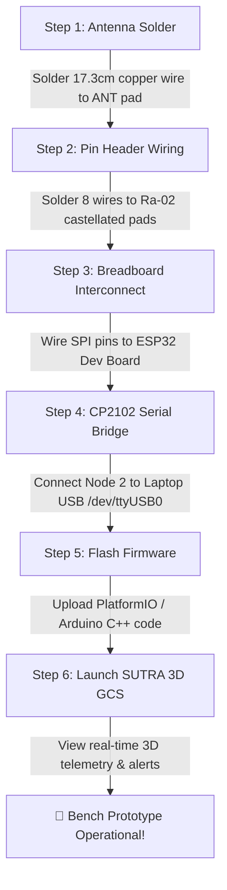

# 🛠️ Step-by-Step Beginner Hardware Assembly & Laptop Connection Guide

**Author & Lead Engineer:** Nikhil (Tech Architect & Subsystem B Lead)  
**Target Hardware:** Invoice `INV2627/130768` (ESP32-S3 CAM, 2x ESP-WROOM-32, 2x Raw Ai-Thinker Ra-02 LoRa, CP2102, Breadboard, Jumpers)  
**Active Branch:** `feature/subsystem-b-comms`

---

## ⚠️ Critical Hardware Warnings (Read First!)

> [!CAUTION]
> **NEVER POWER ON OR TRANSMIT ON A LORA MODULE WITHOUT AN ANTENNA ATTACHED!**  
> Transmitting without an antenna creates impedance mismatch. The RF power reflects back into the Semtech SX1278 Power Amplifier (PA) chip and will **permanently burn out the LoRa module**.

---

## 📡 Part 1: Dealing with Raw Ai-Thinker Ra-02 LoRa Chips (No Pins / No Antenna)

The **Ai-Thinker Ra-02** module comes as a Surface Mount Device (SMD) with castellated pads around the edges and an IPEX/U.FL antenna connector + `ANT` solder pad.

### A. How to Attach an Antenna (DIY 17.3 cm Wire Antenna)
For 433MHz frequency, the radio wavelength $\lambda \approx 69.2\text{ cm}$. A quarter-wave ($\lambda / 4$) monopole antenna requires exactly **17.3 cm** of wire:

1. Cut a piece of single-core copper wire (or jumper wire) to **exactly 17.3 cm (6.8 inches)**.
2. Strip 2 mm of insulation from one end.
3. Solder the stripped end to the **`ANT` pad** on the Ra-02 board.
4. Keep the wire straight pointing upward during operation.
*(Alternative: Solder an IPEX/U.FL-to-SMA pigtail cable and screw on a 433MHz rubber duck antenna).*

---

### B. How to Solder Pins to the Raw Ra-02 Chip
Because the Ra-02 pads have a 2.0 mm pitch (slightly smaller than standard 2.54 mm breadboards):

* **Method 1 (Soldering Jumper Wires Directly)**:
  - Take male-to-female jumper wires.
  - Cut off one male end, strip 2 mm of insulation, and solder the wire directly to the Ra-02 pads (`VCC`, `GND`, `NSS`, `MOSI`, `MISO`, `SCK`, `RST`, `DIO0`).
* **Method 2 (Using an ESP-07 / Ra-02 Adapter Plate)**:
  - Solder the Ra-02 chip onto a 2.0mm-to-2.54mm adapter plate (costs ~$0.50 / ₹20 at electronics shops), allowing it to plug into your breadboard easily.

---

## 🔌 Part 2: Breadboard Wiring Schematic (Zero Ambiguity)

```
┌─────────────────────────────────────────────────────────────────────────┐
│                      BREADBOARD WIRING SCHEMATIC                        │
│                                                                         │
│   ESP32-WROOM-32 Dev Board               Ai-Thinker Ra-02 (433MHz)      │
│   ┌─────────────────────┐               ┌─────────────────────────┐     │
│   │ 3V3 (3.3V Pin)      ├───────────────┤ VCC                     │     │
│   │ GND                 ├───────────────┤ GND                     │     │
│   │ GPIO 5 (NSS/CS)     ├───────────────┤ NSS                     │     │
│   │ GPIO 18 (SCK)       ├───────────────┤ SCK                     │     │
│   │ GPIO 19 (MISO)      ├───────────────┤ MISO                    │     │
│   │ GPIO 23 (MOSI)      ├───────────────┤ MOSI                    │     │
│   │ GPIO 14 (RESET)     ├───────────────┤ NRESET                  │     │
│   │ GPIO 2 (DIO0)       ├───────────────┤ DIO0                    │     │
│   └─────────────────────┘               │ ANT ────► 17.3cm Wire   │     │
│                                         └─────────────────────────┘     │
└─────────────────────────────────────────────────────────────────────────┘
```

---

## 💻 Part 3: Connecting the Micro Project Nodes to Your Laptop

```
┌─────────────────────────────┐                    ┌─────────────────────────────┐
│  NODE 1: "UAV ALPHA" NODE   │                    │  NODE 2: "UAV BETA" RELAY   │
│                             │                    │                             │
│  ESP32-S3 AI Camera +       │    433MHz LoRa     │  ESP32 Dev Board +          │
│  ESP32 Dev Board            ├─ ─ ─ ─ ─ ─ ─ ─ ─ ─►│  LoRa Ra-02 Transceiver     │
│                             │     RF Link        │              │              │
│  Power via USB Power Bank   │                    │       (UART Serial)         │
└─────────────────────────────┘                    └──────────────┼──────────────┘
                                                                  │
                                                        CP2102 USB-to-TTL
                                                        Converter Cable
                                                                  │
                                                                  ▼
                                                   Laptop USB Port (/dev/ttyUSB0)
                                                                  │
                                                      SUTRA 3D GIS GCS Dashboard
                                                       (Mapbox GL JS @ 60 FPS)
```

### Step-by-Step Connection Instructions:

1. **Node 1 ("UAV Alpha") Powering**:
   - Plug the ESP32-S3 CAM and ESP32 Node 1 into any USB port or USB power bank for 5V power.

2. **Node 2 ("UAV Beta") Laptop Connection**:
   - Connect Node 2's ESP32 to the **CP2102 USB 2.0 to TTL Converter**:
     - `ESP32 TX0 (Pin GPIO 1)` ───► `CP2102 RXD`
     - `ESP32 RX0 (Pin GPIO 3)` ───► `CP2102 TXD`
     - `ESP32 GND` ───► `CP2102 GND`
   - Plug the CP2102 USB into your laptop.

3. **Verifying Laptop Port in Linux**:
   - Open terminal and run: `ls /dev/ttyUSB*` or `dmesg | grep tty`.
   - Your device will appear as `/dev/ttyUSB0` or `/dev/ttyACM0`.

4. **Streaming Data into SUTRA 3D GIS GCS**:
   - The receiving node outputs JSON telemetry @ 115200 baud over serial.
   - Launch the GCS dashboard:
     ```bash
     cd sutra_ws/src/sutra_gcs
     npm run dev
     ```
   - Open `http://localhost:5173` in your browser to view live 3D drone positions, LoRa signal RSSI (-48 dBm), and survivor location alerts!

---

## 🗺️ Part 4: Step-by-Step Execution Plan Flowchart


