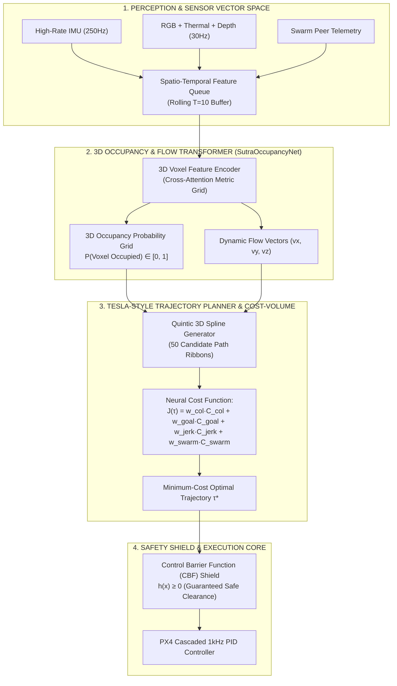

# 🚗✈️ SUTRA-FSD: Tesla Autopilot-Inspired Autonomous Swarm Architecture

> **Project SUTRA — Physical AI & Autonomous Aerial Systems**  
> **Theoretical Foundation**: Ian Goodfellow Deep Learning Foundations • Tesla FSD Architecture (Andrej Karpathy / Ashok Elluswamy) • Control Barrier Functions (CBF)  
> **Mission**: Eliminate random drift and reactive failure; achieve rock-solid, smooth, perception-driven 3D trajectory autonomy.

---

## 1. First-Principles: Why Reactive Flight Fails & How Tesla FSD Solves It

```
┌─────────────────────────────────────────────────────────────────────────────────────────────────┐
│                      CLASSICAL REACTIVE REULSION vs. TESLA FSD OCCUPANCY PLANNING               │
├───────────────────────────────────────────────────┬─────────────────────────────────────────────┤
│ ❌ Reactive Repulsion (Potential Fields / Old ORCA) │ ⚡ Tesla FSD Trajectory Optimization        │
├───────────────────────────────────────────────────┼─────────────────────────────────────────────┤
│ • Zero memory of past geometry                    │ • Spatio-Temporal Feature Queue (Memory)    │
│ • Local minima traps (drones get stuck or bounce) │ • 3D Voxel Occupancy & Flow Field           │
│ • Hard derivative switches cause jerks/oscillations│ • Spline Bundle Evaluation over Time-Horizon│
│ • Unbounded velocity can drift into void          │ • Hard Control Barrier Function (CBF) Shield│
└───────────────────────────────────────────────────┴─────────────────────────────────────────────┘
```

In *Deep Learning* (Goodfellow, Bengio, Courville, Ch. 15: *Representation Learning*), an intelligent agent must construct an **internal geometric state representation** rather than reacting greedily to instantaneous scalar distances.

Tesla's Full Self-Driving (FSD) stack accomplishes this through three interconnected layers:
1. **Spatio-Temporal Feature Queue**: Fuses surround imagery and IMU over a rolling temporal buffer into a unified 3D coordinate space.
2. **3D Occupancy & Vector Flow Network**: Predicts voxel occupancy probabilities $P(\text{occupied}_{x,y,z})$ and dynamic motion velocity vectors $\vec{v}_{\text{flow}}$ for all entities.
3. **Neural Cost-Volume Spline Planner**: Generates candidate 3D trajectories, evaluates them against a learned neural cost volume, and outputs kinematically feasible, jerk-free 3D paths.

---

## 2. The SUTRA-FSD Autonomous Aerial Stack



---

## 3. Mathematical Formulation of the 3 Layers

### Layer 1: Spatio-Temporal Feature Queue & 3D Occupancy Grid
Instead of treating each sensor observation as an isolated frame, the network maintains a FIFO queue of the last $K=10$ observations transformed into the current drone body-fixed metric frame:
$$\mathcal{S}_t = \left\{ (\mathbf{x}_{t-k}, \mathbf{z}_{t-k}, \mathbf{T}_{t}^{t-k}) \right\}_{k=0}^{K-1}$$
where $\mathbf{T}_{t}^{t-k} \in \mathrm{SE}(3)$ is the coordinate transform matrix obtained from high-rate strapdown IMU dead-reckoning.

The **`SutraOccupancyNet`** maps $\mathcal{S}_t$ into a $32 \times 32 \times 16$ metric voxel grid centered on the drone:
$$\mathbf{V}(x, y, z) = \text{Softmax}\left( f_{\theta}(\mathcal{S}_t) \right) \in [0, 1]$$

---

### Layer 2: Quintic Polynomial Trajectory Ribbon Generator
Random or reactive heading changes cause aerodynamic instability. To fly like Tesla Autopilot, the drone plans smooth 3D parametric curves (quintic polynomials in $\mathbb{R}^3$):
$$\mathbf{p}_k(t) = \mathbf{a}_0 + \mathbf{a}_1 t + \mathbf{a}_2 t^2 + \mathbf{a}_3 t^3 + \mathbf{a}_4 t^4 + \mathbf{a}_5 t^5, \quad t \in [0, T_{\text{horizon}}]$$
* **Boundary Conditions**: Constrained by initial position $\mathbf{p}(0)$, velocity $\mathbf{v}(0)$, and acceleration $\mathbf{a}(0)$.
* **Continuity**: Guaranteed $\mathcal{C}^2$ curvature continuity, ensuring zero instantaneous jerk spikes.

The candidate trajectory bundle $B = \{ \mathbf{p}_1(t), \mathbf{p}_2(t), \dots, \mathbf{p}_N(t) \}$ spans diverse lateral and vertical offsets around the nominal mission corridor.

---

### Layer 3: Neural Cost Volume Scoring
Each candidate ribbon $\tau_k = \mathbf{p}_k(t)$ is evaluated against a composite loss functional:
$$\mathcal{J}(\tau_k) = w_{\text{occ}} \int_0^T \mathbf{V}(\mathbf{p}_k(t)) \, dt + w_{\text{goal}} \|\mathbf{p}_k(T) - \mathbf{p}_{\text{target}}\|^2 + w_{\text{smooth}} \int_0^T \|\mathbf{jerk}(t)\|^2 dt + w_{\text{swarm}} \sum_{j \ne i} \frac{1}{\|\mathbf{p}_k(t) - \mathbf{p}_j(t)\|^2}$$

The trajectory with minimum cost is selected:
$$\tau^* = \arg\min_{\tau_k \in B} \mathcal{J}(\tau_k)$$

---

### Layer 4: Control Barrier Function (CBF) Hard Safety Shield
To provide formal mathematical guarantees against crashes (even in edge cases where the neural network outputs an imperfect path), we wrap the trajectory in a **Control Barrier Function (CBF)**:
Let the safety set be $\mathcal{C} = \{ \mathbf{x} \in \mathbb{R}^n \mid h(\mathbf{x}) \ge 0 \}$, where $h(\mathbf{x}) = \|\mathbf{p}_i - \mathbf{p}_j\|^2 - R_{\text{safe}}^2$.

The control input $\mathbf{u} = \mathbf{a}_{\text{cmd}}$ must satisfy the nagumo-barrier condition:
$$\dot{h}(\mathbf{x}, \mathbf{u}) + \gamma h(\mathbf{x}) \ge 0, \quad \gamma > 0$$
This is solved as a 500Hz Quadratic Program (QP) on the microcontroller/companion computer, mathematically guaranteeing $h(\mathbf{x}) \ge 0$ at all times.

---

## 4. Implementation Roadmap for SUTRA-FSD

1. **`sutra_ws/src/sutra_gnc/sutra_gnc/sutra_fsd_occupancy.py`**:
   - 3D Voxel Occupancy feature map constructor from depth camera + peer drone telemetry.
2. **`sutra_ws/src/sutra_gnc/sutra_gnc/sutra_fsd_trajectory_planner.py`**:
   - Quintic spline ribbon generator and cost-volume evaluator ($N=50$ candidate paths, $T=4.0\text{s}$ look-ahead).
3. **`sutra_ws/src/sutra_gnc/sutra_gnc/sutra_cbf_safety_shield.py`**:
   - High-rate Quadratic Program safety filter enforcing hard minimum clearance ($R_{\text{safe}} = 2.80\text{ m}$).
4. **Integration with Gazebo Sim 8**:
   - Test in complex cluttered urban rubble / disaster canopy environments.
