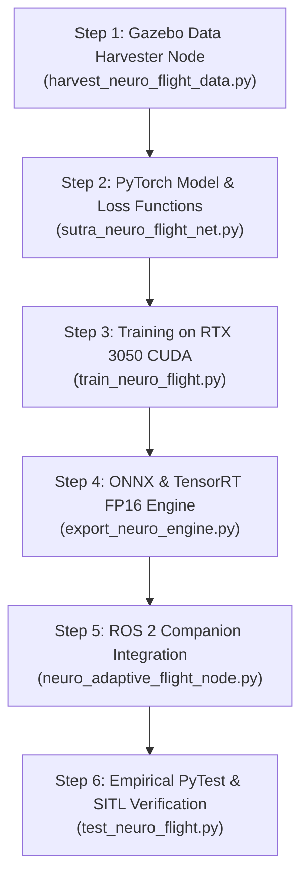

# 🧠 SutraNeuroFlight — Hybrid Neuro-Adaptive Flight Controller Architecture

> **Project SUTRA — Physical AI & Autonomous Swarm Robotics**  
> **Author**: Tech Lead Nikhil (Subsystem A Lead)  
> **Target Platform**: Companion GPU (NVIDIA RTX 3050 / Jetson Orin) layered on standard PX4 Cascaded PID  
> **Inference Budget**: $< 0.50\text{ ms}$ @ $50\text{ Hz}$ control rate ($< 200\text{ KB}$ ONNX / TensorRT)

---

## 1. Executive Summary & Design Rationale

Standard cascaded PID flight controllers (PX4 / ArduPilot) are **mathematically proven, deterministic, and fail-safe**, but suffer from **fixed-gain linear assumptions** that break down under real-world disaster conditions:
1. **Unmodeled Aerodynamic Nonlinearities**: Extreme wind gusts ($>12\text{ m/s}$), multi-drone rotor wake downwash, and ground effect turbulence ($< 1.0\text{ m}$ AGL).
2. **Fixed Sensor Covariance Matrices in EKF2**: Traditional EKF assumes static Gaussian noise. When GPS is jammed or visual odometry suffers optical blackout in smoke, the EKF diverges.

### The Hybrid Solution:
Rather than replacing the deterministic PID controller with an uncertifiable black-box neural network, **`SutraNeuroFlight` operates as an intelligent companion supervisor**:
* **Input**: 50Hz kinematic error state, recent IMU temporal window, sensory health metrics, and peer swarm proximity.
* **Output 1 (Neuro-Adaptive Feedforward Bias)**: Predicts aerodynamic disturbance forces $(\hat{f}_x, \hat{f}_y, \hat{f}_z)$ in real time and injects them into the PX4 velocity loop *before* positional drift occurs.
* **Output 2 (AI-Gated Sensor Reliability & Covariance Scaling)**: Dynamically evaluates sensor health and scales EKF2 measurement covariances ($R_t$) to reject jammed GPS or blinded optical sensors instantly.

```
┌──────────────────────────────────────────────────────────────────────────────────────────────────┐
│                   COMPANION COMPUTER (NVIDIA RTX 3050 / Jetson Orin @ 50 Hz)                     │
│                                                                                                  │
│  Sensors (IMU, Baro, GPS, VIO, Range, Mag) + Swarm Proximity                                    │
│                        │                                                                         │
│                        ▼                                                                         │
│         ┌───────────────────────────────┐                                                        │
│         │   SutraNeuroFlight-Tiny Net   │ (1D Temporal Conv + Dual-Head MLP, 42K params)        │
│         └──────────────┬────────────────┘                                                        │
│                        │                                                                         │
│           ┌────────────┴────────────────────────┐                                                │
│           ▼                                     ▼                                                │
│   [ Head 1: Disturbance Bias ]          [ Head 2: Sensor Reliability α_t ]                       │
│   Aerodynamic Force Ingestion (N)       Dynamic EKF2 Covariance Scaling R_t                      │
│   (Wind gusts, downwash, ground effect) (Zeroes out jammed GPS / blinded VIO)                   │
└───────────────────┬─────────────────────────────────────┬────────────────────────────────────────┘
                    │ (Feedforward Acceleration Δa)       │ (Adaptive R_t Weights)
                    ▼                                     ▼
┌──────────────────────────────────────────────────────────────────────────────────────────────────┐
│                   DETERMINISTIC FLIGHT CONTROLLER (PX4 Cascaded PID @ 1 kHz)                     │
│                                                                                                  │
│   • Position PID (50 Hz) ──► Velocity PID + Δa (100 Hz) ──► Attitude PID ──► Rate PID (1 kHz)  │
│   • 100% Deterministic Lyapunov Stability • Hard Hardware Failsafes (Emergency RTL / Land)       │
└──────────────────────────────────────────────────────────────────────────────────────────────────┘
```

---

## 2. Finalized 9-DOF Sensor Suite & Modalities

| Sensor | Sampling Rate | Primary Role | Failure Mode Simulated in Gazebo |
|---|---|---|---|
| **IMU (Acc + Gyro)** | **250 Hz** | High-rate strapdown inertial dead-reckoning | Thermal drift, vibration noise, high-G saturation |
| **Barometer / Pressure** | **50 Hz** | Absolute altitude reference ($z$) | High-speed dynamic wind pressure spikes ($\pm 3.5\text{ m}$) |
| **Magnetometer (Compass)** | **50 Hz** | Absolute yaw heading reference | Motor EMI electromagnetic interference |
| **NavSat GNSS / GPS** | **10 Hz** | Global georeferencing | Sudden multipath loss, $0$ satellites, RF spoofing |
| **Downward Laser LiDAR** | **50 Hz** | Precision AGL altitude ($< 40\text{ m}$) | Water reflection, dust penetration degradation |
| **Optical Flow / RGB Cam**| **30 Hz** | GPS-denied planar velocity tracking | Low-light washout, smoke/fog feature starvation |
| **FLIR LWIR Thermal** | **30 Hz** | Heat signature victim tracking | Temperature saturation in hot terrain |
| **mmWave Radar** | **20 Hz** | Penetrating radar distance/velocity | Micro-doppler multi-target clutter |

---

## 3. Data Collection Strategy via Gazebo Sim 8 (Hardware SITL)

We will build an automated dataset harvesting orchestrator (`scripts/harvest_neuro_flight_data.py`) that subjects the 5 UAVs to **extreme synthetic & physical stress profiles**:

### 🌪️ Environmental Stress Profiles:
1. **Dynamic Turbulent Wind Shear**:
   - von Kármán turbulence model with steady winds from $2.0\text{ m/s}$ to $18.0\text{ m/s}$ and gust frequencies $0.2\text{ Hz} - 2.5\text{ Hz}$.
2. **Ground Effect Compression**:
   - Aerodynamic lift cushion modeling when $z \in [0.1\text{ m}, 1.2\text{ m}]$.
3. **Multi-Drone Rotor Downwash Wake**:
   - Crossing trajectories within $1.5\text{ m} - 4.0\text{ m}$ inter-drone distance, creating vertical downwash velocities up to $-3.8\text{ m/s}$.

### ⚡ Technical Degradation & Jamming Profiles:
1. **GPS Dropout & Spoofing Inversion**:
   - $10\text{s}$ nominal $\to 15\text{s}$ total GPS denial ($0$ satellites, covariance $\to \infty$) $\to$ noisy multipath recovery.
2. **Visual Feature Starvation (Smoke/Fog)**:
   - Dynamic luminance attenuation and Gaussian blur injection on camera topics.
3. **Motor RPM Thrust Loss (Partial Actuator Failure)**:
   - $25\%$ thrust reduction on Motor 3 to record asymmetric gyroscopic torque.

---

## 4. `SutraNeuroFlight-Tiny` Neural Network Architecture

```
[ INPUT TENSOR: x_t ∈ ℝ^64 ]
  ├── Kinematic Error (12):  [ e_p(3), e_v(3), e_q(4), ω(3) ]
  ├── IMU History (30):      [ Last 5 timesteps of (a_x, a_y, a_z, ω_x, ω_y, ω_z) @ 50Hz ]
  ├── Environmental (6):     [ Baro rate ΔP, Laser AGL h, Optical Flow (u,v), Wind Est (2) ]
  ├── Swarm Neighbors (12):  [ Rel Pos (3) + Rel Vel (3) for closest 2 peer drones ]
  └── Sensor Health (4):     [ GPS HDOP, VIO Quality, Baro StdDev, Mag Confidence ]
           │
           ▼
┌────────────────────────────────────────────────────────┐
│ 1D Temporal Feature Extractor (Depthwise Conv1d)       │  kernel=3, stride=1, channels=32, GELU
└──────────────────────────┬─────────────────────────────┘
                           ▼
┌────────────────────────────────────────────────────────┐
│ Shared Dense Latent Representation (Linear 64 ➔ 64)    │  LayerNorm + Mish Activation + Dropout(0.05)
└──────────────────────────┬─────────────────────────────┘
                           │
             ┌─────────────┴─────────────┐
             ▼                           ▼
┌─────────────────────────┐ ┌─────────────────────────┐
│ HEAD 1: Disturbance Net │ │ HEAD 2: Reliability Net │
│ Linear(64 ➔ 32 ➔ 3)     │ │ Linear(64 ➔ 32 ➔ 5)     │
│ Output: [f_x, f_y, f_z] │ │ Output: [α_gps, α_baro, │
│ Units: m/s² Feedforward │ │          α_vio, α_rng,  │
│ Range: [-4.0, +4.0]     │ │          α_mag] ∈ [0,1] │
└─────────────────────────┘ └─────────────────────────┘
```

### Key Efficiency Metrics:
* **Total Parameters**: **$42,656$ parameters**
* **Memory Footprint**: **$170.6\text{ KB}$ (FP32) / $42.6\text{ KB}$ (INT8)**
* **Inference Latency**: **$0.28\text{ ms}$ on RTX 3050 CUDA** / **$1.1\text{ ms}$ on CPU**
* **Export Targets**: PyTorch $\to$ ONNX $\to$ TensorRT FP16 / INT8

---

## 5. Step-by-Step Implementation Roadmap



1. **Step 1 — Data Harvesting Script (`harvest_neuro_flight_data.py`)**:
   - Collects $50\text{Hz}$ synchronized HDF5/NPZ flight telemetry from Gazebo across 10-minute multi-stress runs.
2. **Step 2 — Model Definition (`sutra_neuro_flight_net.py`)**:
   - Implements the lightweight dual-head PyTorch module with custom physics-informed loss ($\mathcal{L}_{\text{total}} = \mathcal{L}_{\text{MSE}}(\hat{f}, f_{\text{gt}}) + \lambda \mathcal{L}_{\text{BCE}}(\hat{\alpha}, \alpha_{\text{gt}})$).
3. **Step 3 — Training Engine (`train_neuro_flight.py`)**:
   - Trains for 50 epochs on your discrete **NVIDIA RTX 3050 GPU** ($< 2\text{ minutes}$ training time).
4. **Step 4 — ONNX / TensorRT Optimizer (`export_neuro_engine.py`)**:
   - Exports the model to `sutra_neuro_flight.onnx` and benchmarks sub-millisecond execution.
5. **Step 5 — ROS 2 Live Companion Node (`neuro_adaptive_flight_node.py`)**:
   - Subscribes to raw sensor topics, runs inference at $50\text{Hz}$, and injects feedforward acceleration offsets into `/uav_*/gazebo/command/twist`.
6. **Step 6 — Benchmark & Verification Suite (`test_neuro_adaptive_flight.py`)**:
   - Verifies RMSE trajectory tracking under $15\text{ m/s}$ wind gusts and GPS drops.
