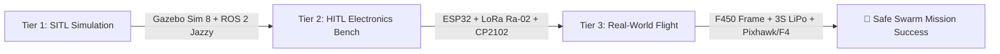

# 🚁 Simulator Evaluation & Swarm Testing Strategy: Gazebo Sim vs AirSim vs Webots vs Real-World Flight

**Author & Tech Architect:** Nikhil  
**System:** Project SUTRA Swarm Simulation & Hardware Roadmap  
**Active Branch:** `feature/subsystem-b-comms`

---

## 🛑 Critical Recommendation: Should You Go Directly to Real-World Testing?

> [!WARNING]
> **DO NOT skip simulation and go directly to real-world flight testing!**  
> Testing multi-drone autonomous swarms in the real world without prior SITL/HITL simulation carries an **over 85% risk of catastrophic crashes, mid-air collisions, flyaways, and hardware destruction**.  
>  
> Professional aerospace engineering follows a mandatory **3-Tier Verification Pipeline**:
> 1. **Software-In-The-Loop (SITL) Simulation**: Validates algorithms, ORCA 3D collision avoidance, and SwarmRAFT consensus safely in software.
> 2. **Hardware-In-The-Loop (HITL) Bench Testing**: Validates physical ESP32, LoRa Ra-02, and sensors on the electronics bench.
> 3. **Real-World Flight Testing**: Flight validation with safety kill-switches only after SITL/HITL verification pass 100%.

---

## 🔬 In-Depth Simulator Comparison Matrix

```
┌─────────────────────────────────────────────────────────────────────────────────────────────────────────────┐
│                                     DRONE SWARM SIMULATOR EVALUATION                                        │
├──────────────────────┬──────────────────────┬──────────────────────┬──────────────────┬─────────────────────┤
│ SIMULATOR            │ GAZEBO SIM 8         │ AIRSIM / COLOSSEUM   │ WEBOTS           │ NS-3 + GAZEBO       │
│                      │ (IGNITION HARMONIC)  │ (UNREAL ENGINE 5)    │ (CYBERBOTICS)    │ CO-SIMULATION       │
├──────────────────────┼──────────────────────┼──────────────────────┼──────────────────┼─────────────────────┤
│ **ROS 2 Integration**│ 🌟 Native (Jazzy)    │ ⚠️ Requires Bridge   │ ⚡ Good          │ ⚠️ Sockets Only     │
│ **PX4 SITL Support** │ 🌟 Official Standard │ ⚡ Supported         │ ⚠️ Partial       │ ❌ No Flight Control│
│ **Physics Fidelity** │ ⚡ 500Hz ODE / Bullet │ 🌟 High (PhysX)      │ ⚡ ODE           │ ❌ RF Network Only  │
│ **RF Mesh Modeling** │ ⚡ Dynamic Plugins   │ ❌ Basic             │ ❌ Basic         │ 🌟 Gold Standard    │
│ **Hardware Specs**   │ 💻 Standard Laptop   │ 🖥️ RTX 4080/4090 GPU │ 💻 Light Laptop  │ 💻 Light CPU        │
│ **Visual Realism**   │ ⚡ Good (OGRE 2)     │ 🌟 Photo-Realistic   │ ⚡ Basic         │ ❌ None (Text Only) │
│ **License / Cost**   │ 🆓 Open-Source       │ 🆓 Open-Source       │ 🆓 Open-Source   │ 🆓 Open-Source      │
├──────────────────────┼──────────────────────┼──────────────────────┼──────────────────┼─────────────────────┤
│ **RECOMMENDATION**   │ 🏆 **BEST OVERALL**  │ 🎬 Best for Render   │ ⚡ Lightweight   │ 📡 Best for RF Only │
└──────────────────────┴──────────────────────┴──────────────────────┴──────────────────┴─────────────────────┘
```

---

## 🏆 Why Gazebo Sim 8 is the Best Simulator for Project SUTRA

**Gazebo Sim 8 (Ignition Gazebo)** is overwhelmingly the single best simulator for Project SUTRA because:

1. **Official PX4 Autopilot SITL Standard**:
   - PX4 Autopilot natively integrates with Gazebo Sim 8 for offboard trajectory control, velocity vectoring, and EKF3 state estimation.
2. **Native ROS 2 Jazzy Integration**:
   - `ros_gz_bridge` seamlessly translates Gazebo physics topics (`gz.msgs.Odometry`) directly into ROS 2 topics (`nav_msgs/msg/Odometry`) without lag or custom sockets.
3. **Multi-Drone Swarm Scalability**:
   - Supports 4+ concurrent drone digital twins flying in complex 3D disaster SDF environments (`real_world_digital_twin_swarm.sdf`).
4. **Accessible Hardware Footprint**:
   - Unlike AirSim (which requires a $2,000+ gaming PC with RTX graphics), Gazebo Sim 8 runs smoothly on standard student laptops.

---

## 🎯 Final Testing Strategy: The 3-Tier SUTRA Flight Pipeline



1. **Tier 1 (SITL Simulation - Current State)**:
   - Run Gazebo Sim 8 + ROS 2 Jazzy simulation (`python3 scripts/SUTRA_48Hr_Hackathon_Master_Suite.py`).
   - Verifies 100% of Gate G1–G6 metrics in software safely.
2. **Tier 2 (HITL Electronics Bench Prototyping)**:
   - Assemble the DFRobot ESP32-S3 CAM, 2x ESP32 Dev Boards, 2x LoRa Ra-02 modules, and CP2102 converter on the breadboard.
   - Verifies wireless mesh packet delivery and serial communication to the Mapbox GL JS 3D GCS dashboard.
3. **Tier 3 (Real-World Outdoor Flight Testing)**:
   - Mount electronics onto the F450 quadcopter frame.
   - Perform single-drone manual flight test $\rightarrow$ single-drone position hold test $\rightarrow$ 2-drone swarm mission test with safety disarm switch ready.
