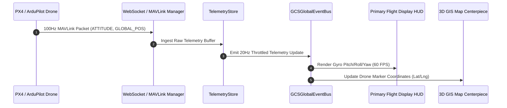
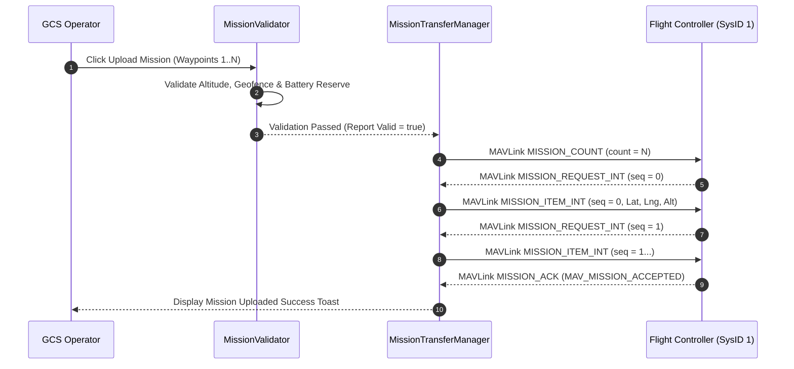
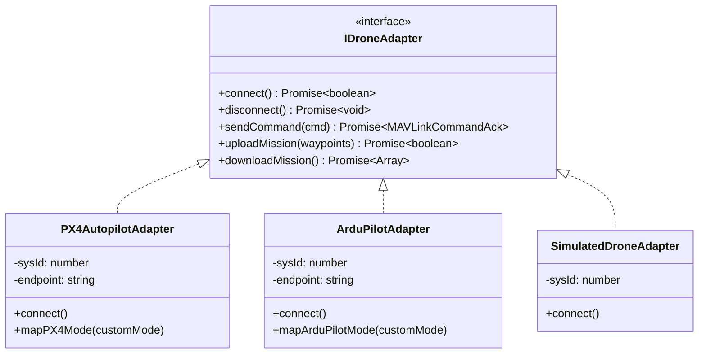

# Smart Horizon GCS — Architecture & Sequence Diagrams

## 1. MAVLink Telemetry Streaming Sequence Diagram

---

## 2. MAVLink Mission Upload Handshake Sequence Diagram

---

## 3. UAV Adapter Pattern UML Class Diagram

